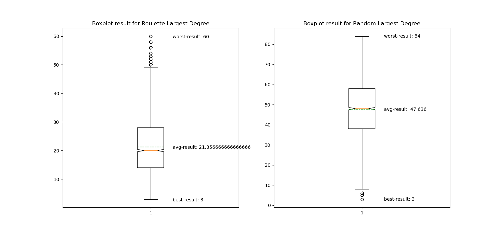
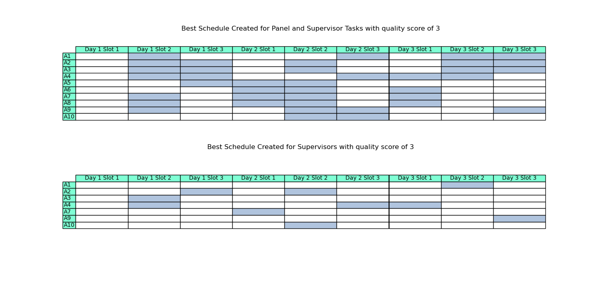
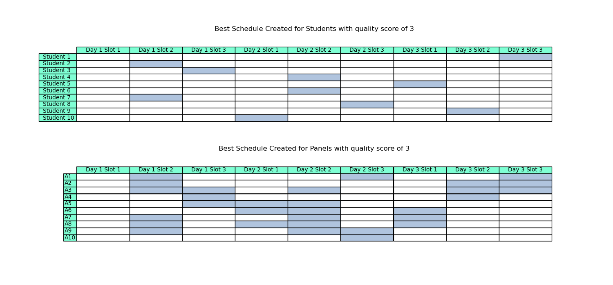

<h1> Graph Colouring Algorithm for Timetabling </h1>

    <h2>Objective</h2>
    <ol>
        <li>Be able to construct a timetable the most efficient way</li>
    <ol>

 

    <h2>Algorithm used</h2>
    <ol>
        <li>Largest Degree Heuristics with Random Wheel Selection</li>
        <li>Largest Degree Heuristics with Roulette Wheel Selection</li>
    <ol>

 

    <h2>How</h2>
    <ol>
        <li>Run <samp>main.py</samp> with data (<samp>sample_data.txt</samp>)</li>
    <ol>

 

    <h2>Sample Result</h2>
    
    
    

 

